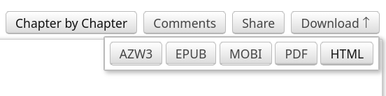

# AO3 Bookify

A Python script that converts an HTML download of an AO3 fanfiction into a reader-friendly(?) PDF file.

## Requirements
- [`uv`](https://docs.astral.sh/uv/) must be installed on your system; this helps manage dependencies and makes it a little easier to run the script.

## Usage

1. Download the fanfiction you wish to bookify from AO3 (either via clicking Download at the top left corner, then HTML, or by just right clicking the fic when viewing the whole work and selecting Save Page As).

  - Alternatively, you can also pass a URL to the fic and AO3Bookify will download its contents automatically.
2. Run AO3Bookify by running 
  ```console
  $ uv run parser.py
  ```
Usage instructions are down below.
```
usage: AO3Bookify [-h] [-o OUTPUT] [--no-notes] path

Python program that parses a HTML download of an AO3 fic.

positional arguments:
  path                 The path to the HTML file containing the fic. Can also be a URL to the fic itself.

options:
  -h, --help           show this help message and exit
  -o, --output OUTPUT
  --no-notes           Remove author notes from the output.
```